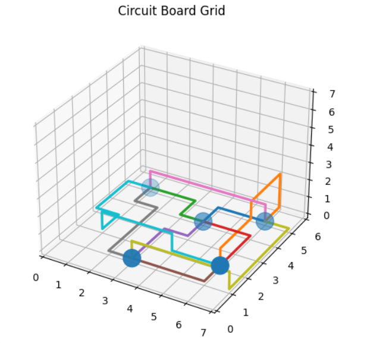

# **Chips and Circuits**
Chips kunnen worden gebruik voor het vervullen van verschillende functies in apparaten zoals computers en bijvoorbeeld telefoons. Chips zijn meestal logisch ontworpen en getransformeerd naar een lijst (netlist) met koppelbare poorten (gates). In de praktijk is het leggen van de bedrading (vanaf nu 'routes' genoemd) tussen de chips een moeilijke en kostbare taak. De manier waarop de routes tussen de chips worden gelegd is van groot belang. Kortere routes leiden tot minder kosten en snellere circuits, terwijl langere routes leiden tot hogere kosten en langzamere circuits. Kruisingen van routes leiden tot een grote verhoging van de kosten. 

In dit project zijn de chips zelf al geplaatst en houden wij ons alleen bezig met de routes tussen de chips op een zo kort mogelijk manier te leggen met zo weinig mogelijk kruisende routes, om dus zo weinig mogelijk kosten te genereren. Bij het leggen van de routes wordt er rekening gehouden met een aantal restricties. De route mag zichzelf niet kruizen en de route mag niet door een andere chip heen lopen. Het is de bedoeling om alle chips met elkaar te verbinden met zo weinig mogelijk kosten. Hieronder is een formule te zien hoe de kosten in het circuit worden berekend, waarbij *n*  een stukje lijn tussen 2 coördinaten voorstelt en *k* het aantal kruisingen tussen routes voorstelt.

```C = n + 300 * k```  

Het bord is 3 dimensionaal. De hoogte is altijd 8. De niveaus lopen van 0, waar de chips op liggen, tot en met niveau 7. De lengte en breedte hangen af van de coördinaten van de chips. Hieronder is een voorbeeld van een opgeloste netlist te zien (netlist 3):  

  

*Figuur 1: Plot van een opgeloste netlist*

## **Aan de Slag**
### **Vereisten**
Deze codebase is volledig geschreven in [Python3.7.3](https://www.python.org/downloads/). In requirements.txt staan alle benodigde packages om de code succesvol te draaien. Deze zijn gemakkelijk te installeren via pip d.m.v. de volgende instructie:  

```pip install -r requirements.txt```

### **Structuur**
* **code:** 
  * .py-bestanden 
* **data:**
  * **chip_0:**
    * netlist.csv-bestanden  en print.csv-bestanden 
  * **chip_1:**
    * netlist.csv-bestanden en print.csv-bestanden 
  * **chip_2:**
    * netlist.csv-bestanden en print.csv-bestanden
* **doc:**
  * afbeeldingen voor in de README.md
* **output:**
  * **chip_0:**
    * output.csv-bestand van netlist 1-3 
  * **chip_1:**
    * output.csv-bestand van netlist 4-6
  * **chip_2:**
    * output.csv-bestand van netlist 7-9
  * **optimize:** 
    * output.csv-bestand 
  * **plots:**
    * plot.png-bestanden
* README.md
* requirements.txt
* run.py (lost de gewenste netlist op)
* try_all.py (lost alle netlists op)  

 De netlist.csv-bestanden bevatten de informatie welke chips met elkaar verbonden moeten worden. De print.csv-bestanden bevatten de x,y-coordinaten van de chips in de netslisten. De output.csv-bestanden bevatten de coordinaten van de routes die zijn gelegd. En de plot.png-bestanden bevatten de plots die bij deze routes horen.


### **Testen**
Om het programma te gebruiken, is daar de volgende instructie voor nodig:  

```python run.py {chip} {netlist}```  

Vervolgens zal het programma nog een aantal vragen stellen over welke variable gebruikt moeten worden. De variable waaruit gebleken is dat deze het beste resultaat opleveren, worden als suggestie aangedragen.

Om alle netlists op te lossen, moet het volgende geëxecuteerd worden:

```python try_all.py ```  

Dit runt het programma met dezelfde variabelen voor elke netlist. Om verschillende waarden voor elke netlist te gebruiken, is het handiger om ze apart te runnen. Optioneel kunnen de variabelen in ```try_all.py``` op regel 18-23 naar wens aangepast worden.


## **Algoritmes**
### **Random**
Het eerste algoritme wat voor dit project is gebruikt is het random algoritme. Voor elk huidige punt op het grid wordt een lijst met mogelijkheden gemaakt welke richting de route op kan. Wanneer er op een van de mogelijkheden een andere chip ligt of als dat de plek is waar de route net vandaan kwam, wordt deze mogelijkheid uit de lijst gehaald. Het random algoritme kiest een random (volgend) punt uit deze lijst met keuzes en probeert zo alle routes te leggen. In deze versie is het dus nog mogelijk voor routes om zichzelf en andere routes te kruisen.  

*Dit algoritme is te vinden in de branche "random"*

### **Depth First Search (DFS) en Breadth First Search (BFS)**
Om aan het random algoritme iets meer restricties toe te voegen, hebben we eerst een DFS-algoritme gebruikt. Hierbij werden de restricties dat routes zichzelf en andere routes niet mogen kruisen toegevoegd. Dat laatste mag volgens de casus wel, maar is dusdanig ongunstig dat we het in eerste instantie verboden hebben. De netlist werd echter snel te groot om een DFS te kunnen toepassen. Daarom hebben we deze omgeschreven naar een BFS. Deze zal natuurlijk altijd de kortste route vinden, nooit een willekeurige route. Met een maximale diepte voor de BFS konden de eerste paar routes wel opgelost worden, maar daarna werden de routes toch te lang en ingewikkeld. Ook werden er routes ingesloten door eerder gelegde routes, waardoor het überhaupt niet meer mogelijk was voor deze routes om de eindchip te bereiken. Om dit een klein beetje op te lossen hebben we de volgorde waarin de routes gelegd worden aangepast. De routes werden neergelegd op volgorde van de Manhattan distance tussen de begin- en eindchip. De route tussen de begin- en eindchip met de kortste Manhattan distance wordt als eerste gelegd. Ook met deze toevoeging, gebeurd het dat routes die later gelegd worden ingesloten worden door eerder gelegde routes. Ook kan dit algoritme erg lang duren.

*Deze algoritmes zijn te vinden in de branches "dfs" en "bfs"*

### **A\***
Om het algoritme iets sneller te laten werken, hebben we het BFS-algoritme omschreven naar een A*-algoritme. Ook hier leggen we de routes op volgorde van de kleinste naar de grootste Manhattan distance. Voor de heuristiek gebruiken we de Manhattan distance. Dit werkte vrij goed. Wat alleen opviel, is dat routes vrij weinig gebruik maakte van andere lagen, waardoor het op laag 0 erg vast kwam te liggen. Dit zorgde er voor dat er vrij veel routes op het laatste nog steeds niet gelegd worden. Er was in die gevallen simpelweg geen mogelijkheid om van de begin- naar de eindchip te komen zonder andere routes te kruisen. 

#### **Extra kosten**
Het hierboven omschreven probleem hebben we aangepakt door de heuristiek aan te passen. Eerst gebruikten we dus de Manhattan distance, maar aangezien alle chips op de nulde verdieping liggen, is het nooit voordelig om naar een andere laag te gaan. Daarom hebben we bij de Manhattan distance een extra kostte toegevoegd. Op dezelfde laag blijven geeft hogere extra kosten dan wanneer een route naar een andere laag gaat. Toen we dit hadden geïmplementeerd en voor verschillende extra kosten hadden getest, werden er veel meer routes gevonden. De optimale extra kosten bleek voor op dezelfde laag blijven 2, voor omhoog gaan 0 en voor naar beneden gaan 1. Zie **Experiment** voor meer details.

| Netlist  | A*       | A* met verbeterde heuristiek |
| -------- | -------- | ---------------------------- |
| 1        | 0        | 0      |
| 2        | 0        | 1      |
| 3        | 1        | 1      |
| 4        | 8        | 4      |
| 5        | 17       | 12     |
| 6        | 25       | 17     |
| 7        | 22       | 24     |
| 8        | 27       | 23     |
| 9        | 43       | 30     |  

*Tabel 1: Niet gevonden routes per netlist per versie van het algoritme. Hoe hoger het netlist nummer, hoe ingewikkelder en groter de netlist*

Deze oplossing geeft wel als probleem dat routes vaak heen en weer gaan en dus niet altijd de kortste route nemen. De routes nemen de vorm van 'koraal' aan, zoals in de afbeelding hieronder te zien:

  

*Figuur 2: Het 'koraalprobleem'*

#### **Optimimaliseren**
Om het 'koraalprobleem' op te lossen, gooien we elke route wanneer alle routes geplaatst zijn door een functie genaamd "*optimize*". Deze functie begint aan de uiteindes van de route (dus bij de begin- en eindchip) en werkt naar binnen toe. Elke keer probeert hij tussen de twee punten op de route te kijken of er een goedkopere route tussen die twee punten is. Mocht dat zo zijn, dan wordt dat stuk van de oude route vervangen door een nieuwe route.

#### **Recursief**
Om ons algoritme meer routes te laten vinden, hebben we een recursieve functie gemaakt. Wanneer er een route niet geplaatst kan worden, neemt deze de route die volgende de Manhattan distance zo ver mogelijk gekomen is. Vervolgens gaat hij opzoek naar lijnen die tussen het laatste punt van deze route en het eindpunt liggen. Dit gebeurd op alle lagen. De eerste (en daarmee de dichtstbijzijndste) route die vanaf het laatste punt tussen het laatste punt en het eindpunt gevonden wordt, wordt verwijderd. De lijn die eerst helemaal niet gelegd kon worden probeert hij daarna opnieuw te plaatsen met A*. Lukt dit niet, wordt er weer boven aan dit verhaal begonnen. Nadat deze lijn geplaatst is, wordt de verwijderde lijn opnieuw geplaatst. Ook wanneer dit niet lukt, wordt er weer bovenaan dit verhaal begonnen.

```
def recursieve_functie(a,b):
  vind een route r1 van punt a naar b met behulp van A*

  als dit lukt:
    return r1
  
  als dit niet lukt:
    neem de route r1 die het verst gekomen 
    neem het laatste punt op deze route r1
    zoek naar routes tussen dit laatste punt en b_r1
    
    als er een route r2 gevonden is:
      verwijder route r2
      recursieve_functie(a_r1, b_r1)
      recursieve_functie(a_r2, b r2)    
```    

Voor het optimale resultaat, roepen we tussendoor weer de functie *optimize* aan voor een specifieke lijn. Uiteindelijk konden door deze methode weer meer routes gelegd worden, zoals in de tabel hieronder te zien is:

| Netlist  | A*       | A* met verbeterde heuristiek | A* met optimize en recursieve functie |
| -------- | -------- | ---------------------------- | ---------------------------- |
| 1        | 0        | 0      | 0  |
| 2        | 0        | 1      | 0  | 
| 3        | 1        | 1      | 0  |
| 4        | 8        | 4      | 3  |
| 5        | 17       | 12     | 11 |
| 6        | 25       | 17     | 16 |
| 7        | 22       | 24     | 20 |
| 8        | 27       | 23     | 21 |
| 9        | 43       | 30     | 27 |

*Tabel 2: Niet gevonden routes per netlist per versie van het algoritme. Hoe hoger het netlist nummer, hoe ingewikkelder en groter de netlist*

#### **Iteratief**
Voor we een recursieve functie hadden, hebben we ook nog een andere manier geprobeerd om het algoritme te verbeteren. Dit deden we iteratief. Wanneer we een route vonden, werd er gekeken of deze significant langer was dan de Manhattan distance. De waarde die we voor 'significant langer' gekozen hadden was 1.5 keer groter. Wanneer zo veel mogelijk routes met A* met verbetere heuristiek gelegd waren, werd een kopie van het huidige bord gemaakt. Daarna werden deze routes verwijderd van het gekopiëerde bord en opnieuw neergelegd in een willekeurige volgorde. Per nieuwe route, als deze route goedkoper is dan de vorige, wordt het huidige bord het gekopiëerde bord. Anders werd de route weer weggehaald en werd verder gegaan met het oude bord. Deze versie leverde echter slechtere resultaten op en werd dus geschrapt.

*Deze versie van het A\* algoritme is te vinden in de branche "astar-optimize-iterative"*


### **Hill climber**
Het vorige beste algoritme (Recursief) gaf nog onafgemaakte routes terug voor netlist 4 tot en met 9. Hierdoor hebben we nu een recursief A* algoritme gemaakt die als eerst zoveel mogelijk routes probeert te vinden, en vervolgens kruisingen toestaat voor de routes die nog niet zijn gevonden. Deze routes worden eerst gelegd langs de kortste Manhattan distance, waarna de hill climber wordt toegepast om de totale kosten te verminderen. 

De gebruiker bepaalt een aantal variabelen in de hill climber. De hill climber gaat alle routes nog een keer af. Dit wordt X keer gedaan, elke keer met een geshuffelde volgorde van de netlist. Dan wordt per loop Y keer een willekeurig gewicht tussen 0 en Z gegeven aan de richtingen (windstreken, omhoog en naar beneden) in de heuristiek van A*, waarbij een hoger gewicht een stap met die richting 'duurder' maakt. De enige voorwaarde is dat het gewicht voor omhoog niet het hoogste gewicht mag zijn, omdat dit slechte scores gaf. Dan wordt voor elke route in de netlist een nieuwe route onderzocht volgens A* met de opgeslagen gewichten. Als de netlist goedkoper is geworden, wordt de oude route vervangen door de nieuwe.

| Netlist  | Versie A Kosten | Versie B Kosten |
| -------- | -------- | -------- |
| 1        | 22       | 22     |
| 2        | 43       | 43     |
| 3        | 64       | 64     |
| 4        | 10853    | 6987   |
| 5        | 21435    | 14269  |
| 6        | 52181    | 38187  |
| 7        | 84732    | 47322  |
| 8        | 76926    | 44012  |
| 9        | 114987   | 74295  |

*Tabel 3: Kosten per netlist per versie van het algoritme. Hoe hoger het netlist nummer, hoe ingewikkelder en groter de netlist. Versie A = A\* met optimize en recursieve functie. Wanneer de laatste paar lijnen echt niet gelegd kunnen worden, worden deze op de kortst mogelijke manier gelegd (met behulp van A\*). Het maakt dan niet uit als ze andere lijnen kruisen. Versie B = Versie A, maar na afloop nog een hill climber algoritme.*


## **Experiment**
Om te testen welke waarden voor verschillende gebruikte variabelen optimaal zijn om in de beste versie de kosten nog verder te verlagen, zijn verschillende combinaties getest.
De variabelen waar naar gekeken is zijn de strafkosten voor de richtingen (de windrichtingen en omhoog en naar beneden, in de code 'wind', 'up' en 'down'), het bereik van de willekeurige waarden hiervoor bij de hill climber ('options'), het maximale aantal verschillende combinaties voor deze strafkosten ('len_choices') en hoe vaak dit alles herhaald moet worden met een willekeurige leg volgorde van de routes ('shuffles').  

Eerst is onderzocht wat de beste wind, up, down is door verschillende combinaties van wind, up, down te runnen en kosten te berekenen voor elke netlist. Voor wind, up en down is gekeken naar elke combinatie van waarden van 0 tot en met 4. Dit zijn dus 5\*5\*5 = 125 mogelijke combinaties. Na meerdere keren runnen zijn we er achter gekomen dat als up de hoogste waarde heeft, dat dit tot slechte resultaten levert. Ook zijn we er achter gekomen resultaten waarbij de verhouding tussen wind up en down vergelijkbaar is als bij 2, 0 en 1, respectievelijk, dit tot geen significante verschillen opleverde. Daarom hebben we gekozen voor wind = 2, up = 0 en down = 1.

Vervolgens is gekeken wat de beste combinatie van options, len_choices, en shuffles zijn. Hierbij is gekeken naar de waarden 5 en 10 voor options, 10, 50 en 100 voor len_choices en 1 en 5 voor shuffles. Dit zijn dus 2\*3\*2 = 12 mogelijke combinaties. Ook hier is een lagere prijs een betere score.


## **Resultaten**  
!random te vaak runnen voor goede resultaten
DFS doet te te lang en sloot zichzelf in
BFS deed te lang, ging wel voor kortste route maar sloot zichzelf ook in
A* ook vaak in de knoop want bleef vaak op niveau 0
extra kosten 201 vind wel meer routes, maar loste niet meer netlists op
optimize maakte bestaande routes korter nadat de routes gelegd werd wat een kleine winst in de kosten opleverde
recursieve functie loste netlist 3 op en verbeterde andere netlists
voor hillclimber werden overige routes volgens Manhattan distance gelegd, daarna hillclimber, die leverde de volgende kosten op:

## **Idee voor in de toekomst**
Op dit moment is er nog veel variatie in de resultaten. Het is daarom wellicht een goed idee om uit te zoeken of er een patroon is bij welke random configuraties in de hill climber de beste resultaten gevonden worden.

## **Autheurs**
* Rachel de Haan
* Viola Koers
* Finn Peranovic

## **Dankwoord**
* Onze TA's Marleen en Pamela en alle andere TA's die ons geholpen hebben
* Minor programmeren van de Universiteit van Amsterdam (2021-2022)
